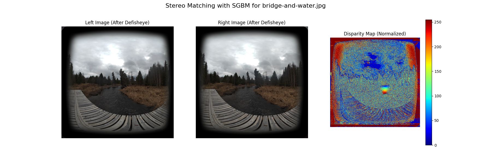

# SBS 3D Image to Depth Map Converter

This Python project takes a side-by-side (SBS) 3D image, typically from a VR180 or similar 3D camera, and attempts to generate a disparity map. This disparity map can then be converted into a depth map if camera calibration parameters (focal length and baseline) are known.

The script utilizes OpenCV for stereo matching algorithms (StereoSGBM and StereoBM) and the `defisheye` library to correct for fisheye lens distortion, which is common in many wide-angle 3D cameras. It also features an interactive mode for tuning SGBM parameters.



## Features

*   Processes Side-by-Side (SBS) 3D images.
*   Fisheye correction using the `defisheye` library.
*   Stereo matching using OpenCV's StereoSGBM (default) or StereoBM algorithms.
*   Interactive mode for real-time tuning of StereoSGBM parameters using OpenCV trackbars.
*   Option to scale images during interactive tuning for faster feedback.
*   Conversion of disparity map to depth map if focal length and baseline are provided.
*   Saves normalized disparity maps, depth maps (if generated), and summary plots.
*   Command-line interface for all operations.

## Prerequisites

*   Python 3.7+
*   A virtual environment (e.g., venv, conda) is recommended for managing dependencies.

## Setup

1.  **Clone the repository:**
    ```bash
    git clone https://github.com/Tarnyd/3D-Disparity-map.git
    cd 3D-Disparity-map
    ```

2.  **Create a virtual environment (recommended):**
    The provided `setup_windows.bat` script (for Windows users) attempts to create a virtual environment named `env` and install dependencies.
    Alternatively, you can create it manually:
    ```bash
    python -m venv env
    ```
    Activate the environment:
    *   Windows: `env\Scripts\activate`
    *   macOS/Linux: `source env/bin/activate`

3.  **Install dependencies:**
    The `requirements.txt` file lists the necessary packages.
    If you used `setup_windows.bat`, it should have handled this. Otherwise, with your virtual environment activated, run:
    ```bash
    pip install -r requirements.txt
    ```
    The main dependencies are:
    *   `opencv-python`
    *   `matplotlib`
    *   `numpy`
    *   `defisheye`
    *   `Pillow`

4.  **Prepare Input Images:**
    Place your SBS 3D image files (e.g., `.jpg`, `.png`) into the `input_images/` directory (create this directory if it doesn't exist).

## Usage

The main script is `src/sbs_to_depth.py`. All operations are performed via the command line. Ensure your virtual environment is activated.

### Basic Usage (with Defisheye Correction)

This command processes an image, applies fisheye correction, and generates a disparity map using default SGBM parameters.

```bash
python src/sbs_to_depth.py "input_images/your_sbs_image.jpg" --defisheye_fov 190 --defisheye_pfov 120
```

*   `--defisheye_fov`: Field of View of the original fisheye lens (e.g., 190 degrees). Set to 0 to disable defisheye.
*   `--defisheye_pfov`: Preserved Field of View after correction (e.g., 120 degrees).

Output files will be saved in the `output_images/` directory by default (create this directory if it doesn't exist).

### Interactive SGBM Parameter Tuning

This is highly recommended for finding optimal SGBM parameters for your specific camera and scenes.

```bash
python src/sbs_to_depth.py "input_images/your_sbs_image.jpg" --interactive_mode --defisheye_fov 190 --defisheye_pfov 120 --interactive_scale 0.25
```

*   `--interactive_mode`: Enables the interactive tuning GUI.
*   `--interactive_scale`: Scales down the images during interactive tuning for faster processing (e.g., `0.25` for 1/4 size, `0.5` for 1/2 size). Adjust this based on your image resolution and system performance.

Several OpenCV windows will open:
*   "SGBM Interactive Tuning": Contains trackbars for all SGBM parameters.
*   "Disparity Map (Interactive)": Shows the live-updated disparity map.
*   "Left Gray (Interactive)" and "Right Gray (Interactive)": Show the processed (e.g., defished) left and right views.

Adjust the trackbars to see the effect on the disparity map. Press 'q' in one of the OpenCV windows to close the interactive session. The last used SGBM parameters will be printed to the console. You can then use these parameters for a non-interactive run on the full-resolution image.

### Generating a Depth Map

If you know your camera's **baseline** (distance between the two lenses in meters) and the **focal length** (in pixels, *after* any undistortion/defishing), you can generate a metric depth map.

```bash
python src/sbs_to_depth.py "input_images/your_sbs_image.jpg" \
    --defisheye_fov 190 --defisheye_pfov 120 \
    --baseline 0.065 --focal_length YOUR_FOCAL_LENGTH_IN_PIXELS \
    --sgbm_num_disp 256 --sgbm_block_size 7  # (Use parameters found via interactive mode)
```
*   `--baseline`: E.g., `0.065` for 65mm.
*   `--focal_length`: This is `fx` from the camera matrix. This value is critical and difficult to guess. True camera calibration is needed for accuracy.

### All Command-Line Options

Run `python src/sbs_to_depth.py --help` to see all available options:

```
usage: sbs_to_depth.py [-h] [--algorithm {SGBM,BM}] [--output_dir OUTPUT_DIR] [--defisheye_fov DEFISHEYE_FOV]
                       [--defisheye_pfov DEFISHEYE_PFOV] [--defisheye_dtype DEFISHEYE_DTYPE]
                       [--defisheye_format DEFISHEYE_FORMAT] [--focal_length FOCAL_LENGTH] [--baseline BASELINE]
                       [--max_depth_vis MAX_DEPTH_VIS] [--interactive_mode] [--interactive_scale INTERACTIVE_SCALE]
                       [--sgbm_min_disp SGBM_MIN_DISP] [--sgbm_num_disp SGBM_NUM_DISP]
                       [--sgbm_block_size SGBM_BLOCK_SIZE] [--sgbm_p1 SGBM_P1] [--sgbm_p2 SGBM_P2]
                       [--sgbm_disp12_max_diff SGBM_DISP12_MAX_DIFF] [--sgbm_pre_filter_cap SGBM_PRE_FILTER_CAP]
                       [--sgbm_uniqueness_ratio SGBM_UNIQUENESS_RATIO]
                       [--sgbm_speckle_win_size SGBM_SPECKLE_WIN_SIZE] [--sgbm_speckle_range SGBM_SPECKLE_RANGE]
                       [--sgbm_mode SGBM_MODE]
                       sbs_image_path

Create a disparity and (optionally) depth map from an SBS image.

positional arguments:
  sbs_image_path        Path to the SBS image file.

options:
  -h, --help            show this help message and exit
  --algorithm {SGBM,BM}
                        Stereo algorithm. (default: SGBM)
  --output_dir OUTPUT_DIR
                        Directory for output files. (default: output_images)
  --defisheye_fov DEFISHEYE_FOV
                        FOV for the fisheye lens (degrees). 0 to not use defisheye. Ex: 190 (default: 0)
  --defisheye_pfov DEFISHEYE_PFOV
                        Preserved FOV after defisheye (degrees). Ex: 120 (default: 120)
  --defisheye_dtype DEFISHEYE_DTYPE
                        Defisheye dtype (e.g., linear, equalarea). (default: linear)
  --defisheye_format DEFISHEYE_FORMAT
                        Defisheye format (e.g., fullframe, circular). (default: fullframe)
  --focal_length FOCAL_LENGTH
                        Focal length in pixels (for depth calculation). (default: None)
  --baseline BASELINE   Baseline in meters (for depth calculation). (default: None)
  --max_depth_vis MAX_DEPTH_VIS
                        Max depth for depth map visualization (meters). (default: 10.0)
  --interactive_mode    Start interactive mode for SGBM parameter tuning. (default: False)
  --interactive_scale INTERACTIVE_SCALE
                        Scale factor for images in interactive mode (e.g., 0.25 for 1/4 size). (default: 0.25)
  --sgbm_min_disp SGBM_MIN_DISP
                        SGBM minDisparity. (default: None)
  --sgbm_num_disp SGBM_NUM_DISP
                        SGBM numDisparities. (default: None)
  --sgbm_block_size SGBM_BLOCK_SIZE
                        SGBM blockSize. (default: None)
  --sgbm_p1 SGBM_P1     SGBM P1. (default: None)
  --sgbm_p2 SGBM_P2     SGBM P2. (default: None)
  --sgbm_disp12_max_diff SGBM_DISP12_MAX_DIFF
                        SGBM disp12MaxDiff. (default: None)
  --sgbm_pre_filter_cap SGBM_PRE_FILTER_CAP
                        SGBM preFilterCap. (default: None)
  --sgbm_uniqueness_ratio SGBM_UNIQUENESS_RATIO
                        SGBM uniquenessRatio. (default: None)
  --sgbm_speckle_win_size SGBM_SPECKLE_WIN_SIZE
                        SGBM speckleWindowSize. (default: None)
  --sgbm_speckle_range SGBM_SPECKLE_RANGE
                        SGBM speckleRange. (default: None)
  --sgbm_mode SGBM_MODE
                        SGBM mode index (0-3). 0:SGBM, 1:HH, 2:SGBM_3WAY, 3:HH4. (default: None)
```

## Important Considerations

*   **Image Quality:** The quality of the depth map heavily depends on the input image quality, lighting conditions, scene texture, and the accuracy of the fisheye correction.
*   **Defisheye vs. Full Stereo Rectification:** While `defisheye` corrects distortion for individual images, it does not perform full stereo rectification (which aligns epipolar lines perfectly horizontally). For optimal results, a full stereo camera calibration (`cv2.stereoCalibrate` and `cv2.stereoRectify`) would be necessary to obtain intrinsic and extrinsic camera parameters. This script currently does not implement full stereo calibration.
*   **Focal Length for Depth:** Accurately determining the focal length (in pixels, *after* defisheye/undistortion) is crucial for metric depth calculation. This usually comes from camera calibration.
*   **Performance:** Processing high-resolution images (e.g., from 8K SBS sources) can be computationally intensive, especially the SGBM algorithm. Use the `--interactive_scale` option during tuning.


## License

This project is licensed under the MIT License - see the [LICENSE.md](LICENSE.md) file for details.
